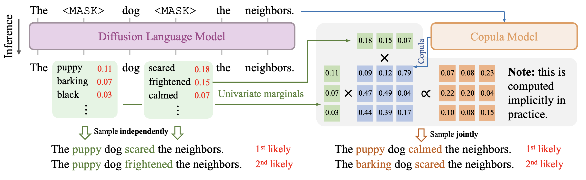

# Discrete Copula Diffusion

The official implementation of "Discrete Copula Diffusion", which was published at ICLR 2025.

## What Is This Paper About?

Diffusion models for discrete data excel at modeling text, but they need hundreds to thousands of diffusion steps to perform well.

We show that this is caused by the fact that discrete diffusion models predict each output token **independently** at each denoising step. This problem can be mitigated by supplementing the missing dependency information with another **copula model** (just any of your favorite generative models).



As shown in the left side of the above figure, diffusion language models individually predict each variable's token probabilities. When multiple ``edits'' are made in a single denoising step, the model fails to consider the probability of these changes happening jointly.

In the paper, we quantify the performance drop by showing that there is an irreducible component in the negative ELBO stemming from this independent denoising assumption, which prevents the model from generating high-quality samples in just a few steps even if the model is perfect.

Since discrete diffusion models learn all univariate marginals well, we use a copula model to additionally capture the dependency information. As shown on the right side of the figure, by combining information from both models, we generate better samples in fewer steps. In particular, by combining a recent discrete diffusion model (https://arxiv.org/pdf/2310.16834) with GPT-2 (small) as the copula model, we achieve better (un)conditioned generation performance in **8-32 fewer denoising steps**.

## 🚀 Draw Conditional Samples

```py
python sample_conditional.py
```

### Key Arguments

- `--diffusion-model`: Which diffusion language model to use (choose from `louaaron/sedd-medium` and `louaaron/sedd-small`).
- `--gpt-model`: Which GPT model to use (e.g., `gpt2`).
- `--steps`: Number of diffusion steps.
- `--seq-len`: Sequence length.
- `--sample-type`: Which algorithm to use for sampling (choose from `DCD_autoregressive`, `DCD_chunked`, `autoregressive`, and `sedd`).
- `--prompt-template`: Defines a list of spans where tokens are given (e.g., `[0.1-0.2][0.5-0.7]`).

### Acknowledgements

This repository is based on [SEDD](https://github.com/louaaron/Score-Entropy-Discrete-Diffusion).
